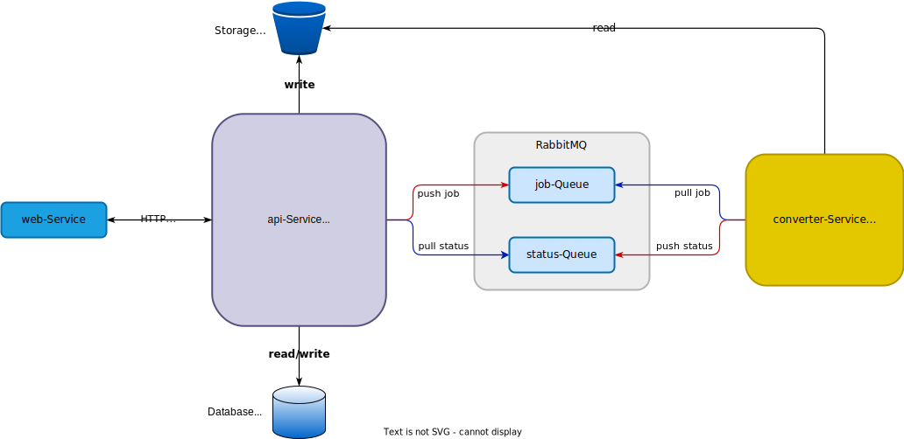

# Architecture

The following describes the architecture of the components `api`, `converter`
and the involved two queues `jobs` and `status`.

## Component Diagram

The application in the backend consists of an `api` service which pushes `job`s
into `jobs`-queue. The `converter` service on the other end consumes the jobs on
the `jobs` queue and sends status updates through the queue `status`. The `api`
service consumes status updates on the `status`-queue and persists them in the
database.

## Database Tables

The data base persists jobs `job` in the `jobs` table and job logs `job-log`
(received on the `status`-queue) in the `job-logs` table. The following entity
relationship diagram holds:

```mermaid
erDiagram
    job {
        uuid id PK "Job id."

        enum status "Job status: 'pending', 'queued', 'done'."
        string blob_digest "Blob SHA265 digest."
        string name "The name of the job."
        timestamp creation_time "The time the job was created."
        timestamp end_time "The time the job was finished."
        enum converter_result "The converter result ('failure', 'success')"
        enum converter_log "The converter full log (stdout/stderr)"
    }

    job-log {
        uuid id PK "The log id."
        uuid job FK "The job id this message belongs to."

        timestamp timestamp "The log's timestamp."
        text message "The status message."
        enum severity "The severity of the status message ('normal', 'error')."
    }

    job ||--o{ job-log: "produces"

```
